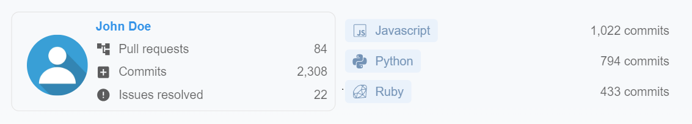
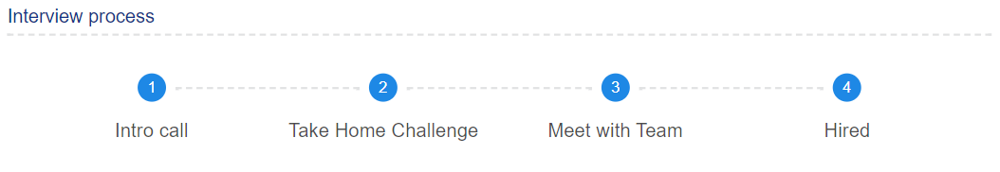

# Rysolv

**Rysolv** ([rysolv.com](http://rysolv.com/)) is the analytics based hiring platform for software engineers.

- **Code focused**: We use Git analytics to turn your contributions into a resume.

  - Generate insights on your git history
  - Showcase your contributions
  - Find employers looking for your exact skills

  

- **Transparent**: All jobs have to disclose Know the salary and interview process before you apply.

  

- **Open Source**:
  - [AGPL-3.0 License](https://github.com/rysolv/rysolv/blob/master/LICENSE)
  - Built for engineers by engineers. If you want to change how people get hired, open a pull request!

## Contributing

- Check out [GitHub Projects](https://github.com/rysolv/rysolv/projects/1) for our current development pipeline

## Community

- [Discord](https://discord.gg/kqt8RcVggN): Talk about code, algorithm meetups, and silly hackathons.

- Also check out the [rysolv/hackathon](https://github.com/rysolv/hackathon) repo for upcoming events.

## Documentation

Getting Started: [/docs/README.md](/docs/README.md)

## License

- [AGPL-3.0](https://github.com/rysolv/rysolv/blob/master/LICENSE)
